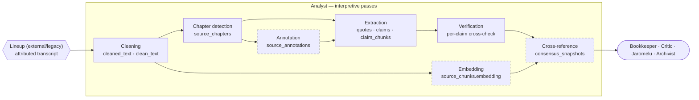

# Analyst — Architecture

> Last reviewed: 2026-05-24.

How Analyst works in depth: where it sits in the pipeline, what it reads and writes (the hand-off contract), the pass chain that turns an attributed transcript into knowledge, the component internals, and the current-vs-target architecture as Lineup externalises. For Analyst's identity, scope, and voice see [README.md](README.md); for the locked design decisions see [charter.md](charter.md); for status and forward plan see [roadmap.md](roadmap.md).

---

## Pipeline position

Analyst is the **interpretive stage** of the multi-agent pipeline. It owns everything from "here is a speaker-attributed transcript" through "here is structured, cross-referenced knowledge." Acquisition is upstream (Scout/bronze); the structural audio→transcript transform (Lineup) is becoming an external service that sits *between* Scout and Analyst; numbers, challenge, and the final voice are downstream.

```
Scout        →  Lineup          →  Analyst        →  Bookkeeper + Critic  →  Jaromelu
(acquire,        (structural:        (this:             (numbers + challenge)   (voice)
 bronze)         audio→attributed    interpret,
                 transcript —        silver)
                 externalising)
```

| Stage | Crew mode | System surface | What it does | Status |
|---|---|---|---|---|
| Acquire | [Scout](../scout/README.md) | [source-discovery](../../system/source-discovery.md), [ingestion](../../system/ingestion.md) | Discover, enumerate, pull audio/video to S3, fetch structured feeds | Media shipped; data in design |
| **Structural transform** | **Lineup** *(externalising)* | [transcription-pipeline](../../system/transcription-pipeline.md), [speaker-identification](../../system/speaker-identification.md) | Diarize + ASR + merge + speaker ID → a speaker-attributed transcript | In-repo path **live but legacy** (per [charter A8](charter.md#a8-disposition-of-the-in-repo-lineup-code--legacy-not-deleted)); external API not built |
| **Interpret** | **Analyst** *(this doc)* | [extraction](../../system/extraction.md), [Transcript Pipeline skill](../../skills/transcript-pipeline.md) | Clean, chapter, annotate, embed, extract entities/quotes/claims, cross-reference for consensus + contradictions | Skill-driven today; workers not built |
| Derive | [Bookkeeper](../bookkeeper/README.md) + [Critic](../critic/README.md) | [decision](../../system/decision.md) | Numeric derivations over extracted claims (alignment, accuracy, breakevens); challenge thin evidence | Partial; decision worker not built |
| Voice | [Jaromelu](../jaromelu/README.md) | [publishing](../../system/publishing.md) | Integrate, commit to a call, publish in the on-screen voice | Live |

> **The Lineup row is the moving piece.** Today its work runs *inside* `services/api/app/analyst/` and `services/gpu/`, which is why the Analyst code directory is dominated by diarization/face files. Per [charter A2](charter.md#a2-lineup-is-a-service-boundary-not-a-sub-module) that work becomes an external service; the rest of this doc treats Lineup's output as **an input Analyst receives**, not a thing Analyst does.

---

## Hand-off contract

Analyst sits between two contracts: the transcript it **reads** (produced by Lineup) and the knowledge it **writes** (consumed by Bookkeeper, Critic, Jaromelu, and the Archivist).

### What Analyst reads — the transcript contract (from Lineup)

Per [charter A3](charter.md#a3-the-input-contract--a-speaker-attributed-transcript), Analyst designs against this shape regardless of producer:

| Table | Fields Analyst relies on |
|---|---|
| `source_documents` | `raw_text`, `language`, `checksum`, `chunk_count`, `s3_key` |
| `source_speakers` | `speaker_label`, `start_ts`, `end_ts`, `speaker_person_id` (+ `match_method`, `match_confidence`), `cluster_label` |
| `source_chunks` | `raw_text`, `chunk_index`, `start_ts`/`end_ts`, char offsets, `speaker_segment_id`, `paragraph_break` |
| `sources` | `transcription_status='transcribed'` |

Speaker attribution reads use `coalesce(cluster_label, speaker_label)` — the `cluster_label` layer is where the (future external) Lineup writes its identity answer.

### What Analyst writes — per interpretive pass

| Table | What Analyst writes | Pass | Status |
|---|---|---|---|
| `source_documents.cleaned_text` | Garbles fixed, restarts merged, filler normalised | Cleaning | Skill-driven |
| `source_chunks.clean_text` | Per-chunk cleaned text | Cleaning | Skill-driven |
| `source_chapters` | Semantic chapters scoping extraction | Chapter detection | Skill-driven (`/analyse-transcript`) |
| `source_annotations` | Sentiment, sub-topic tags, entity mentions, themes | Annotation | Not built |
| `source_chunks.embedding` | Text embedding for retrieval (≠ voice/face embeddings) | Embedding | Not built |
| `quotes` | Verbatim pulls attributed to a `Person` | Extraction | Skill-driven |
| `claims` | Structured claims (type, text, strength, polarity, timestamps) | Extraction | Skill-driven |
| `claim_chunks` | Claim ↔ evidence-chunk links | Extraction | Skill-driven |
| `claim_associations` | Claim ↔ entity links | Extraction | Skill-driven |
| `consensus_snapshots` | Semantic consensus shifts + contradictions across sources | Cross-reference | Not built |

Analyst writes **nothing** to the bronze tables (`scout_candidates`, `channels`, `sources` audio/ingestion fields, `people`, `matches`, `player_rounds`, …) — those are Scout's. It writes **nothing** to the numeric-derivation tables (`predictions`, `decisions`, alignment/accuracy metrics) — those are Bookkeeper's. And it does not compose `wiki_pages` — that's the Archivist's read over Analyst's outputs.

> **Boundary note on `source_speakers`.** Analyst *reads* `speaker_person_id` but does **not** write it — that's Lineup's column. The one exception today is the legacy in-repo path, where transcription writes those rows inline; under the externalised model ([charter A2](charter.md#a2-lineup-is-a-service-boundary-not-a-sub-module)) the producer of `speaker_person_id` is the Lineup service, and Analyst is purely a reader.

---

## Flow

Analyst is a **chain of idempotent passes**, each a transform over the previous pass's output. The chain begins where Lineup hands off (a transcript with `transcription_status='transcribed'`) and ends with cross-referenced knowledge ready for Bookkeeper's math and the Archivist's prose.



**Legend:** hexagon = upstream producer (Lineup) · rounded oval = downstream consumers · dashed = not built.

**Trace:**
1. **Clean** — the attributed transcript's `raw_text` is corrected against the player registry + NRL domain knowledge; `cleaned_text` / `clean_text` written. Everything downstream reads cleaned text, not raw.
2. **Chapter** — semantic chapters segment the transcript so extraction runs with scoped context rather than over an undifferentiated wall of text.
3. **Annotate** *(not built)* — sentiment, sub-topic, entity-mention, and theme tags per chunk/chapter.
4. **Embed** *(not built)* — text embeddings on chunks for retrieval and similarity.
5. **Extract** — multi-pass LLM extraction over (cleaned, chaptered) chunks produces `quotes`, `claims`, and their links. Claims carry type, text, strength, polarity, and timestamps.
6. **Verify** — a per-claim cross-check (Haiku agent per claim) confirms `claim_type`, `claim_text`, `strength`, `polarity`, and timestamps against the transcript before persistence.
7. **Cross-reference** *(not built)* — claims across sources are compared for semantic consensus and contradiction; `consensus_snapshots` records the direction and the disagreement.

The cadence maps to system events, not on-screen beats — see [dynamics.md § Cadence](../dynamics.md#cadence). Analyst fires on "new transcript materialised" and again on "new claims extracted."

---

## Components

Each component follows the same internal structure — trigger, inputs, processing, outputs, status — so they are directly comparable. Components are listed in **pass order**. Component 4.0 (transcript materialisation) is the **legacy Lineup surface** included only for completeness; per [charter A8](charter.md#a8-disposition-of-the-in-repo-lineup-code--legacy-not-deleted) it is frozen and externalising.

### 4.0 Transcript materialisation `[legacy — Lineup, externalising]`

The audio→attributed-transcript transform. **This is the surface moving out of the repo** ([charter A2](charter.md#a2-lineup-is-a-service-boundary-not-a-sub-module)); documented here as the *producer of Analyst's input*, not as Analyst's durable scope.

**Trigger** — `python -m app.analyst.transcribe_cli <source_id>` · `make transcribe SOURCE_ID=<uuid>`.

**Processing** — pyannote 3.1 diarization (turns + 256-dim wespeaker voice embeddings) → Deepgram nova-3 ASR (words + timestamps, keyterm-biased to the canonical roster) → merge (utterances joined to turns by max-overlap) → voice + face + fusion speaker identification. GPU-bound steps run on a SageMaker Async endpoint when `LINEUP_REMOTE=1`. Full detail: [transcription-pipeline.md](../../system/transcription-pipeline.md) + [speaker-identification.md](../../system/speaker-identification.md).

**Outputs** — `source_documents`, `source_speakers` (one row per turn, with attribution), `source_chunks`, and `sources.transcription_status='transcribed'` — i.e. the [transcript contract](#what-analyst-reads--the-transcript-contract-from-lineup) every Analyst pass below reads.

**Status** — live in-repo, **legacy**. Per [charter A8](charter.md#a8-disposition-of-the-in-repo-lineup-code--legacy-not-deleted): fixes only, no new features. End state is an external API returning the same contract. Phase ledger: [README § Lineup status](README.md#lineup-status).

### 4.1 Cleaning pass `[skill-driven]`

Fixes auto-caption artifacts so downstream extraction reads clean text.

**Trigger** — [`/clean-transcript`](../../skills/transcript-pipeline.md) skill. The `POST /api/admin/update-clean-text` endpoint backfills `clean_text` onto existing chunks from an already-cleaned S3 document.

**Inputs** — `source_documents.raw_text` / `source_chunks.raw_text`; the canonical player registry (`people` + `data/players.yaml`); NRL domain knowledge (slang, nicknames, known garbles).

**Processing** — fix mangled player/team names, repair garbled words, merge false-start restarts, normalise filler — without "correcting" legitimate NRL slang (e.g. *PVL*).

**Outputs** — `source_documents.cleaned_text`, `source_chunks.clean_text`.

**Status** — skill-driven; production worker pending the prompt stabilising ([charter A4](charter.md#a4-cleaning--skill-validated-then-workerised)).

### 4.2 Chapter detection `[skill-driven]`

Segments the transcript into semantic chapters so extraction runs with scoped, enriched context.

**Trigger** — [`/analyse-transcript`](../../skills/analyse-transcript.md) skill (hierarchical multi-agent: detect chapters → spawn a specialist per chapter with scoped enrichment data).

**Outputs** — `source_chapters`, plus sub-topic-granular claims when run as the full alternative pipeline.

**Status** — skill-driven; an alternative to the clean→process pipeline, used for chapter-level context.

### 4.3 Embedding pass `[not built]`

Text embeddings on chunks for retrieval and similarity. **Distinct** from the voice/face embeddings Lineup writes (those live on `source_speakers` / `person_voiceprints` / `person_face_embeddings`).

**Outputs** — `source_chunks.embedding`.

**Status** — not built. Model (OpenAI vs Voyage) and index location undecided — see [charter Open Questions](charter.md#open-questions).

### 4.4 Entity / quote / claim extraction `[skill-driven]`

The historical Analyst surface: turn (cleaned, chaptered) chunks into structured claims and quotes.

**Trigger** — [`/process-transcript`](../../skills/transcript-pipeline.md) (multi-pass extraction with automated verification) → [`/verify-claims`](../../system/extraction.md) (per-claim Haiku cross-check) → [`/upload-transcript`](../../skills/transcript-pipeline.md) (persist).

**Inputs** — cleaned chunks, chapters, the entity registry (`people`, `teams`).

**Processing** — multi-pass LLM extraction; each claim gets `claim_type`, `claim_text`, `strength`, `polarity`, `start_ts`/`end_ts`, attributed to the speaking `Person` via the chunk's turn. Verification spins a Haiku agent per claim to cross-check the extracted fields against the transcript.

**Outputs** — `quotes`, `claims`, `claim_chunks`, `claim_associations`.

**Status** — skill-driven; `services/worker-extraction/` is a skeleton. Workerisation is gated by a DeepEval suite ([charter A5](charter.md#a5-extraction--skill-validated-then-workerised-llm-graded)). See [extraction-worker](../../../todo/extraction-worker.md).

### 4.5 Cross-reference / consensus `[not built]`

The pass that makes Analyst *Analyst* in Jaromelu's voice — detecting agreement and contradiction across sources.

**Inputs** — `claims` across sources, with attribution and `match_confidence` carried through.

**Processing** — group claims by entity + topic; detect *semantic* consensus and its direction ("3 sources turned bearish on Cleary since Tuesday"), and contradictions ("KingOfSC says buy, NRLBrothers says sell — same matchup data, opposite reads"). Quantifies by count and direction, **not** by index or weighted score (that's Bookkeeper — [charter A6](charter.md#a6-consensus--contradiction-detection-is-semantic-not-numeric)).

**Outputs** — `consensus_snapshots` (write target: the publishing surface's `update_consensus_snapshots`).

**Status** — not built. See [consensus-engine](../../../todo/consensus-engine.md).

---

## Current vs target architecture

Analyst is mid-transition on two axes at once: **producer** (in-repo Lineup → external service) and **execution** (Claude Code skills → workerised passes).

```
TODAY                                          TARGET
─────                                          ──────
Scout audio in S3                              Scout audio in S3
   │                                              │
   ▼                                              ▼
in-repo Lineup (transcribe.py + GPU)          external Lineup API
  pyannote · Deepgram · voice/face/fusion       (same transcript contract back)
   │  (legacy — charter A8)                       │  (charter A2)
   ▼                                              ▼
attributed transcript  ◄────────── same contract (charter A3) ──────────►  attributed transcript
   │                                              │
   ▼                                              ▼
Claude Code skills:                            Workerised passes (agent_id='analyst'):
  /clean-transcript                              clean  →  chapter  →  annotate
  /analyse-transcript                              →  embed  →  extract  →  verify
  /process-transcript → /verify-claims             →  consensus
  /upload-transcript                             each: idempotent, audited (A7),
   │  (operator-run, per source)                  eval-gated (A5), drained on a schedule
   ▼                                              │
quotes · claims · consensus(by hand)           ▼
                                               quotes · claims · consensus_snapshots
```

**Shared shape across Analyst's target passes** (mirrors Scout's module shape, adapted for LLM work):

1. Each pass is an idempotent transform over the previous pass's output, keyed so a re-run is a no-op when inputs are unchanged.
2. Each pass writes one `agent_runs` row with `agent_id='analyst'`, `detail_json.pass='<pass>'`, plus per-run counts ([charter A7](charter.md#a7-audit--agent_idanalyst-pass-discriminator-in-detail_json)).
3. LLM passes ship behind an eval suite, not a drift test ([charter A5](charter.md#a5-extraction--skill-validated-then-workerised-llm-graded)).
4. Each pass is independently triggerable and drained by a recurring job over the predecessor's completion state.
5. The skill and the worker share one pure module, so they cannot drift ([charter risk #4](charter.md#architectural-risks)).

---

## Related

- [README.md](README.md) — Analyst's identity, scope, and voice
- [charter.md](charter.md) — locked design decisions A1–A8
- [roadmap.md](roadmap.md) — status and the two-track forward plan
- [Transcription pipeline](../../system/transcription-pipeline.md) — the legacy in-repo Lineup surface (stages 1–5)
- [Speaker identification](../../system/speaker-identification.md) — voice + face + fusion detail (legacy Lineup)
- [Extraction](../../system/extraction.md) — claim/entity/quote extraction surface
- [Transcript Pipeline skill](../../skills/transcript-pipeline.md) — the clean → process → verify → upload skill chain
- [Agent audit pattern](../../system/agent-audit.md) — `agent_runs` / `agent_events` / S3 conventions shared across agents
- [Scout architecture](../scout/architecture.md) — the bronze-stage architecture Analyst's interpretive stage consumes
