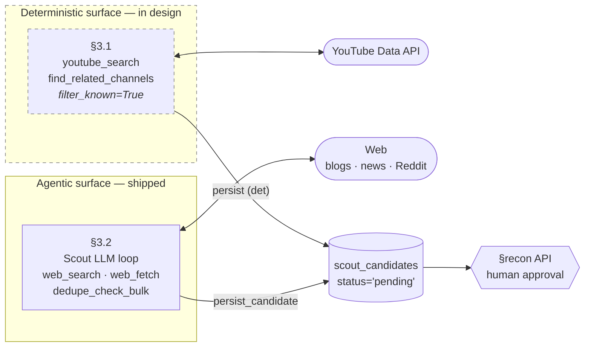
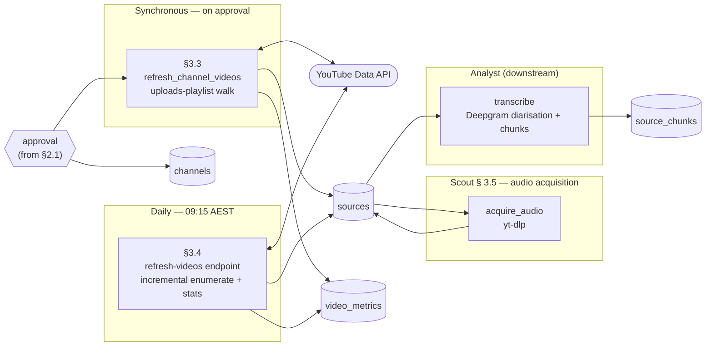

# Scout — Jaromelu's Inventory Mode

> **Charter expansion (2026-05-12).** Scout's scope is being formally expanded from *media inventory* to *all external data acquisition* per the [Scout charter expansion](../../architecture/drafts/scout-charter-expansion.draft.md) (decisions D1–D7 locked). The doc below reflects the **expanded charter**; some sections describe modules that are still in design (SuperCoach roster + stats, NRL.com fetchers for matches, team lists, injuries, rounds). Media-acquisition content is shipped today; data-acquisition content is in design.

**Role:** Acquire and maintain Jeromelu's raw inventory across every external source of truth — NRL media (podcasts, video, blogs, web) and NRL data (SuperCoach API, NRL.com endpoints, league feeds). **Scout is the *Extract* in the system's ETL** — it pulls raw bytes from external sources and persists them as-is. **It does no Transformation** (no cleaning, parsing, diarisation, embedding, normalisation, or interpretation). Those are downstream agents.

Scope is everything from *we don't know about this source* to *raw rows persisted in the database*. Stops at the raw layer.

**Not a separate visible character.** When this mode is active, Jaromelu's voice (and the UI activity status) reflects it. Scout files inventory reports only — claims, contradictions, calls are all downstream.

|                       |                                                                                                                                                              |
| --------------------- | ------------------------------------------------------------------------------------------------------------------------------------------------------------ |
| **Type**              | Crew mode (internal reasoning) + data-acquisition worker                                                                                                     |
| **ETL role**          | **Extract only.** No Transform. (Cleaning, diarisation, parsing, embedding, normalisation are all downstream.)                                               |
| **Scope**             | Media discovery + enumeration + raw transcript pull · SuperCoach roster + stats · NRL.com matches / team lists / injuries / rounds · future: podcasts, Twitter/X, blogs, Reddit |
| **Status**            | **Media side shipped:** agentic discovery, recon API, post-approval enumeration, daily video-stats refresh. **Data side in design:** per the charter expansion, SuperCoach + NRL.com fetchers migrate from `scripts/data/fetchers/` and `services/worker-scraper/` into per-pipeline folders under `services/api/app/scout/` (per D9). |
| **Platform coverage** | Media: YouTube only today; podcasts/RSS/Twitter/blogs/Reddit on backlog. Data: SuperCoach API + NRL.com endpoints land in the charter rollout.            |
| **Code**              | `services/api/app/scout/` — media-discovery agent in flat files (`loop.py`, `prompt.py`, `tools.py`), enumeration / refresh (`refresh.py`), audio acquisition (`audio.py`). **Data acquisition** modules land as **per-pipeline folders** under `scout/` per D9 of the charter: `scout/supercoach_roster/`, `scout/supercoach_stats/`, `scout/nrlcom_matches/`, `scout/nrlcom_teamlists/`, `scout/nrlcom_injuries/`, `scout/nrlcom_rounds/`. Each folder owns its fetcher, Pydantic models, admin route, and README. Transcription / diarisation is Analyst's surface — `services/api/app/analyst/transcribe.py`. Legacy: `services/worker-ingestion/` and `services/worker-scraper/` (Temporal, both superseded). |
| **Trigger**           | Media-discovery agent: manual CLI `python -m app.scout.cli`. Deterministic pipelines (media refresh + all data acquisition modules): `POST /api/admin/scout/<pipeline>` admin endpoints driven by external cron. |
| **Model**             | `claude-sonnet-4-6` via Claude Agent SDK (agentic discovery surface only; data-acquisition modules are deterministic, no LLM)                                |
| **Audit**             | `agent_runs` + `agent_events` + S3 JSONL, `agent_id='scout'` for everything; pipeline distinguished via `detail_json.pipeline` (`media-discovery`, `supercoach-stats`, `nrlcom-teamlists`, …) per D6. See [`agent-audit.md`](../system/agent-audit.md). |
| **Spec**              | [Source discovery](../system/source-discovery.md), [Ingestion](../system/ingestion.md), [Scout charter expansion (draft)](../../architecture/drafts/scout-charter-expansion.draft.md)                                                    |

---

## Pipeline position

Scout is the **inventory stage** of a multi-agent pipeline. It owns everything from "we don't know about this source" through "raw transcripts in the database." Parsing, scoring, numbers, and synthesis are downstream.

```
Scout       →  Analyst    →  Bookkeeper + Critic  →  Jaromelu
(this:         (extract)     (numbers + challenge)   (voice)
 inventory)
```

| Stage | Crew mode | System agent | What it does | Status |
|---|---|---|---|---|
| **Acquire** | **Scout** *(this doc)* | [source-discovery](../system/source-discovery.md), [ingestion](../system/ingestion.md), `scout/<pipeline>/*` folders (in design per D9) | Discover sources, enumerate content, refresh metadata, pull transcripts. **Also:** fetch SuperCoach roster + stats, NRL.com matches / team lists / injuries / rounds. | Media: shipped (YouTube). Data: in design — fetcher code exists in `scripts/data/fetchers/` and `services/worker-scraper/`, migrating into per-pipeline folders under `services/api/app/scout/` per the charter expansion. |
| Extract | [Analyst](analyst.md) | [extraction](../system/extraction.md) (today via [Transcript Pipeline skill](../skills/transcript-pipeline.md)) | Turn raw content into entities, quotes, claims; cross-reference for contradictions | Skill-based today; worker not built |
| Derive | [Bookkeeper](bookkeeper.md) + [Critic](critic.md) | [decision](../system/decision.md) | Apply math to Scout-fetched numbers (breakevens, cap, alignment indices, consensus snapshots), rank, challenge thin evidence. Acquisition itself is now Scout's per the charter expansion. | Decision worker not built; derived metrics partial |
| Voice | [Jaromelu](jaromelu.md) | [publishing](../system/publishing.md) | Integrate everything, commit to a call, publish in the on-screen voice | Live |

### What Scout DOES cover

**Media acquisition (shipped):**

1. **Discovering new channels** across platforms — deterministic YouTube-native search (§3.1, in design) for the bulk case; agentic web hunt today (§3.2, shipped) for off-platform / long-tail. YouTube only today; podcasts / Twitter / blogs / Reddit on backlog.
2. **Enumerating new sources from approved channels** — synchronous uploads-playlist walk on approval (§3.3, shipped) plus incremental daily enumeration of fresh uploads on tracked channels (§3.4, shipped).
3. **Refreshing per-video metadata** — daily snapshot of views / likes / comments into `video_metrics` (§3.4, shipped). Enables view-velocity ranking and breakout detection.
4. **Extracting raw audio** — `acquire_audio()` pulls the m4a for an approved source and lands it in S3 (§3.5, shipped). Diarised transcription of that audio is downstream — owned by Analyst, not Scout.
5. **Refreshing channel-level metadata** — sub count, total views, video count, name changes, active/inactive detection. *Planned* — currently `channel_metrics` is only written at approval time, not periodically refreshed.
6. **Source health / liveness monitoring** — detecting stalled channels, 404 sources, transcript fetch failures, caption regenerations. *Backlog* — not built.
7. **Multi-platform expansion** — instantiate the same shape (discovery → approval → enumerate → refresh → extract) for podcasts (RSS), Twitter/X, blogs/news, Reddit. *Backlog* — schema is platform-agnostic; code is YouTube-only.

**Data acquisition (per the charter expansion):**

Each pipeline lives as a folder under `services/api/app/scout/<pipeline_name>/` per D9 — fetcher, Pydantic models, admin route, README all in the same folder. Fronted by a `POST /api/admin/scout/<pipeline>` admin endpoint driven by cron. **Each fetch writes the raw upstream response to S3 first** (D10); DB extraction is downstream (D13). Trust hierarchy `nrl.com > supercoach.com.au > nrlsupercoachstats.com` (D11). All write under `agent_id='scout'` with `detail_json.pipeline=<name>`. Idempotency per D7, drift tests per D8.

**supercoach.com.au pipelines:**
8. **`supercoach_roster`** — refresh `people` / `people_attributes` / `people_roles` from `players-cf`; also captures `notes[]` (editorial commentary → claims) and `player_stats[]` (per-round) inline. *Phase 1 — shipped.*
9. **`supercoach_teams`** — 17 SC teams; weekly. Cross-references `teams.metadata_json.supercoach`. *Phase 2.5.*
10. **`supercoach_settings`** — SC game rules per season (lockouts, scoring config, captains/emergencies/dual-position rules). *Phase 2.5.*
11. **`supercoach_draft_*`** — parallel of the above three for SC Draft mode. *Optional.*

**nrl.com pipelines (canonical NRL data per D11):**
12. **`nrlcom_draw`** — fixtures + scheduling per (competition, season, round). Historical reach back to 1908. *Phase 3.*
13. **`nrlcom_match_centre`** ★ — per-match goldmine: lineups, ~58-field per-player stat sheets, 100+ typed timeline events, officials, scoring narrative, venue/weather/attendance. **Highest-leverage single pipeline.** Historical back to 2000 (full) / 1990 (thin). *Phase 3.*
14. **`nrlcom_casualty_ward`** — official league-wide injury roll, daily. *Phase 4.*
15. **`nrlcom_ladder`** — team standings + 22 per-team metrics (form, streak, records, margins). *Phase 4.*
16. **`nrlcom_stats`** — pre-computed statistical leaderboards (top-25 per category). *Phase 4.5.*
17. **`nrlcom_players_roster`** — per-team NRL.com profile listing (DOB, image, etc.); folder-organise the existing `players/nrlcom_refresh.py`. *Phase 4.5.*

**nrlsupercoachstats.com pipelines:**
18. **`supercoach_stats`** — per-round jqGrid stats with SC scoring breakdown (base/attack/playmaking/power/negative), breakeven, magic number, consistency metrics. *Phase 2 — shipped.*

### What Scout DOES NOT cover

Per the **Extract-only** rule, anything that interprets, structures, or enriches the raw bytes is downstream:

- **Transcript cleaning** — fixing mangled player names, garbled words, auto-caption errors. Scout writes `raw_text`; the cleaning pass writes `cleaned_text` / `clean_text`. Owned by the [transcript pipeline](../skills/transcript-pipeline.md) / [Analyst](analyst.md).
- **Diarisation + transcription** — turning Scout's audio into `source_documents`, `source_speakers` (turn-level), and `source_chunks` (per-utterance) is owned by [Analyst](analyst.md). Scout stops at the m4a in S3.
- **Speaker → Person resolution** — mapping a `source_speakers.speaker_label` like `speaker_0` to a known `Person`. Downstream of Analyst's transcription pass — voice-fingerprint clustering across episodes plus LLM-assisted attribution from contextual cues.
- **Embedding** — `source_chunks.embedding`, `knowledge_base.embedding`. Owned by the indexer.
- **Semantic chapters** (`source_chapters`) — produced by the analyse-transcript pipeline to scope claim extraction.
- **Annotations** (`source_annotations`) — sentiment, sub-topic tags, entity mentions, themes.
- **Parsing content for meaning** — entity extraction, claim detection, quote pulls. That's [Analyst](analyst.md) ([extraction](../system/extraction.md)).
- **Cross-source consensus or contradiction detection** — Scout reports "5 sources covered the trade"; Analyst reports "4 say sell, 1 says hold."
- **Derived metrics** — alignment indices, advisor accuracy, consensus snapshots, breakeven trajectories. Those are derivations over Scout-fetched data — owned by [Bookkeeper](bookkeeper.md).

*Previously out-of-scope but now in-scope under the [charter expansion](../../architecture/drafts/scout-charter-expansion.draft.md):* Numeric NRL data (SuperCoach scores/prices/breakevens, fixtures, match results, injuries, draw) and player roster registry. The acquisition of these moves to Scout; their derivation and math stay with Bookkeeper.

### Hand-off contract

Scout's outputs are raw inventory rows only — Extract + Load, never Transform. The full chain Scout owns spans **media** (`scout_candidates → channels → sources → audio`) and **data** (`people / people_attributes / player_rounds / matches / match_team_lists / injuries / rounds`).

**Media writes:**

| Table | What Scout writes | What Scout does **not** write |
|---|---|---|
| `scout_candidates` | Full row at discovery (kind, title, score, content_categories, score_reasons, run_id, `status='pending'`) | — |
| `channels` | Full row at approval | — |
| `sources` | Full row at enumeration (`source_type`, title, canonical_url, `approved_flag=true`, `ingestion_status='pending'`) | — |
| `sources.audio_s3_key` + `ingestion_status='collected'` | Set on successful audio acquisition (§3.5) | `transcription_status`, `extraction_method` (Analyst) |
| `channel_metrics` / `video_metrics` | Full row per snapshot | — |

**Data writes (per the charter expansion):**

Every pipeline writes to **S3 (raw response)** + **DB (extracted projection)** per D10. The DB writes below reflect the post-extraction shape:

| Table | What Scout writes | Module folder | Phase |
|---|---|---|---|
| `people` | Roster upsert from SC `players-cf` | `scout/supercoach_roster/` | 1 ✅ |
| `people_attributes` | Position / team / contract (SCD-2); enriched by NRL.com profile data | `scout/supercoach_roster/` + `scout/nrlcom_players_roster/` | 1 ✅ / 4.5 |
| `people_roles` | Primary role tenure (SCD-2) | `scout/supercoach_roster/` | 1 ✅ |
| `claims` + `quotes` (from SC `notes[]`) | SC editorial commentary on players | `scout/supercoach_roster/` (extractor) | 2.5 |
| `teams.metadata_json.supercoach` | SC team IDs cross-reference | `scout/supercoach_teams/` | 2.5 |
| `sc_settings` (new) | SC game rules per season | `scout/supercoach_settings/` | 2.5 |
| `player_rounds` | Per-round stats — D11 merge of nrlcom match-centre + nrlsupercoachstats jqGrid | `scout/supercoach_stats/` + `scout/nrlcom_match_centre/` (extractor merges) | 2 ✅ / 3 |
| `matches` | Fixtures, results, score, venue, attendance, weather | `scout/nrlcom_draw/` + `scout/nrlcom_match_centre/` (extractor) | 3 |
| `match_team_lists` | Lineups from match-centre `positionGroups` + `players[]` | `scout/nrlcom_match_centre/` (extractor) | 3 |
| `player_match_stats` (new) | Per-player per-match 58-field stat line | `scout/nrlcom_match_centre/` (extractor) | 3 |
| `match_timeline` (new) | 100+ typed timeline events per match | `scout/nrlcom_match_centre/` (extractor) | 3 |
| `match_officials` (new) | Referee + touch judges + bunker per match | `scout/nrlcom_match_centre/` (extractor) | 3 |
| `rounds` | Round metadata derived from draw | `scout/nrlcom_draw/` (extractor) | 3 |
| `injuries` | Official casualty-ward state | `scout/nrlcom_casualty_ward/` | 4 |
| `team_standings` (new) | Ladder positions + 22 per-team metrics | `scout/nrlcom_ladder/` | 4 |
| `stat_leaderboards` (new) | Pre-computed top-25 leaderboards | `scout/nrlcom_stats/` | 4.5 |

Scout writes **nothing** to `source_documents`, `source_speakers`, `source_chunks` (Analyst's transcription writes), `source_chapters`, `source_annotations`, `quotes`, `claims`, `claim_chunks`, `claim_associations`, `consensus_snapshots`, `predictions`, `decisions`, `wiki_pages`, or any reasoning/output table. If a Scout-voiced UI line mentions parsed content (e.g. *"deep dive on Munster"*), that content was generated by a downstream agent and is being *surfaced through* Scout's voice mode — not produced by Scout itself.

---

## 1. Voice & Behaviour

**Tonal mode:** Tireless, efficient, nose-to-the-ground. Inventory reporting only — Scout files what was *found*, not what it *means*.

In Scout mode, Jaromelu's voice:
- reports inventory without editorialising — counts of new sources, new uploads, dedupe results
- surfaces volume and novelty at the **source / artefact** level ("4 new episodes", "1 new channel surfaced")
- flags discovery edge-cases ("nothing new since last sweep", "noisy sweep — most results were already-known")
- never parses content, infers themes, detects contradictions, or makes calls — those are [Analyst](analyst.md), [Critic](critic.md), and [Jaromelu](jaromelu.md)'s jobs
- defers any "what was said" claim to downstream agents, even when surfaced through Scout's voice

### Sample lines

These surface as Jaromelu-authored cards with internal mode = Scout. They report **inventory only** — no parsed content:

> "4 new episodes overnight on tracked channels. Indexing now."

> "KingOfSC just dropped a new video. Queued for transcript pull."

> "Nothing new since last sweep. The ecosystem is quiet."

> "3 new channels surfaced this week, 2 already in the dedupe set — 1 worth a closer look."

> "Found a new pod worth tracking — 'Tackles and Tinnies', three episodes deep."

**Out-of-mode lines** (these *look* like Scout but are downstream agents speaking through the same voice frame):

> ~~"4 new episodes overnight. 2 mention Cleary, 1 has a deep dive on Munster."~~ — *parsed content; this is [Analyst](analyst.md).*

> ~~"3 sources are talking about the same trade. That's unusual."~~ — *consensus detection; this is [Analyst](analyst.md).*

---

## 2. Flow

The full Scout function decomposes into two phases joined by a human-approval gate. The two phases answer two unrelated questions, so each gets its own diagram.

All current components are YouTube-only. Multi-platform expansion (podcasts, Twitter, blogs, Reddit) is roadmap — see §4. The diagrams below describe the YouTube path; each platform added later will instantiate the same shape (discovery surface → approval → enumerate → refresh → extract).

The architectural intent for the discovery phase is **deterministic-first for the bulk case, LLM for the long tail**:
- **Deterministic discovery** *(in design)* owns the cheap, fast, reproducible work: YouTube-native search and related-channel walks against a fixed seed-query bank, with server-side filtering against known IDs.
- **Agentic discovery** *(shipped)* owns what the LLM is uniquely good at: off-platform reach (blog / news / Reddit mentions YouTube doesn't see), semantic quality filtering, and coverage-gap targeting.

Both surfaces file into the same `scout_candidates` table. Human approval is the seam where LLM judgement stops and idempotent pipelines take over.

### 2.1 Discovery — *how do candidates land in `scout_candidates`?*



**Legend:** rounded ovals = external systems · cylinders = DB tables · hexagon = human gate · dashed = in design.

**Trace:**
1. **Daily deterministic sweep** (§3.1, in design) — cron runs `youtube_search` over the seed-query bank and `find_related_channels` over every tracked channel. `filter_known=True` means the API call returns only novel IDs. Results persist with `discovered_via='youtube_search' | 'related_channels'`.
2. **Weekly agentic sweep** (§3.2) — Scout LLM loop runs on a slower cadence with a brief that says *"deterministic covers YouTube-native; your job is off-platform reach and the long tail."* Uses `web_search` for blog/news/Reddit mentions, `web_fetch` to read About pages and judge quality, persists what survives.
3. **Human reviews** — admin lists pending candidates via the recon API (regardless of source) and approves or rejects.

**Today vs target:**

| Aspect | Today (shipped) | Target (after deterministic surface lands) |
|---|---|---|
| Bulk YouTube discovery | LLM with `web_search` (slow, expensive) | YouTube API (sub-second, ~$0) |
| Adjacency expansion | LLM intuition | `find_related_channels` (deterministic) |
| Off-platform mentions | LLM with `web_search` | LLM with `web_search` (unchanged) |
| Semantic quality filter | LLM (during search) | LLM (focused, on a smaller candidate set) |
| Cost / run | ~$0.40–$1.00 per agentic run | ~$0 deterministic + ~$0.20 weekly LLM |
| Cadence | Manual CLI | Daily deterministic + weekly LLM |

### 2.2 Tracked-source operations — *how do we keep approved sources current and extract their content?*



**Legend:** rounded ovals = external systems · cylinders = DB tables · hexagon = upstream gate · subgraphs = cadence (sync / daily / dev-only).

**Trace:**
1. **Sync enumeration** (§3.3) — recon-approval handler commits `channels`, then synchronously calls `refresh_channel_videos(full_backfill=True)`. The channel's uploads playlist is walked (capped 200), each video inserted as a `sources` row, and a discovery-time `video_metrics` snapshot is written per video.
2. **Daily cron keeps things current** (§3.4) — `POST /admin/scout/refresh-videos` walks each channel for new uploads using the last known `video_id` as cursor (typically 1 quota unit / channel / day) and re-snapshots stats for every YouTube source. ~750 quota units / pass.
3. **Audio gets collected** (§3.5) — `acquire_audio()` pulls m4a via yt-dlp and lands it in `s3://jeromelu-raw-audio/...`, setting `audio_s3_key` and `ingestion_status='collected'`. Transcription is the next step (Analyst, [transcription](../system/transcription-pipeline.md)). Recurring drain job over `ingestion_status='pending'` sources is on the backlog.

---

## 3. Components

Each component follows the same internal structure — trigger, inputs, processing, outputs, audit — so the five are directly comparable. Components are listed **deterministic-first** to reflect architectural intent (the deterministic surface owns the bulk; the agentic surface is the long-tail layer once both ship), not current build status.

### 3.1 Deterministic discovery `[deterministic, in design]`

Cheap, fast, reproducible YouTube-native discovery. Owns the bulk case (new uploads, adjacent channels) so the agentic surface is freed for off-platform and semantic work. Not yet built — design intent recorded here.

**Trigger** — Daily cron (proposed: 06:00 AET to land before morning content windows).

**Inputs**
- Seed query bank (versioned config) — broad NRL terms ("NRL podcast", "supercoach analysis", "NRLW review", "Cowboys breakdown", etc.)
- Every active channel in `channels` (for related-channel walks)
- YouTube Data API key
- Read-side: `channels.external_id`, `sources.canonical_url`, `scout_candidates.(platform,kind,external_id)` for the server-side filter

**Processing**
1. **`youtube_search(query, filter_known=True)`** — for each seed query, calls `search.list?type=channel,video&regionCode=AU`. Implementation filters returned IDs against the known-set in-process *before* returning to the caller. The agent / persist layer never sees a known result.
2. **`find_related_channels(known_channel_id, limit=10)`** — for each tracked channel, pulls related channels via YouTube's "channels related to" signal (or scrapes the channel's featured-channels surface as fallback). Filters known.
3. Persists novel results directly to `scout_candidates` with `status='pending'` and `discovered_via='youtube_search' | 'related_channels'`. Idempotent on `(platform, kind, external_id)`.

**Outputs** — rows in `scout_candidates` (same table as §3.2, distinguished by `discovered_via`). No score / content_categories on first pass — those are added post-hoc by a lightweight scoring pass (could be deterministic heuristics or a small LLM batch).

**Quota budget** — `search.list` = 100 units/call. ~10 seed queries × daily = 7,000 units/week. ~150 channels × `channels.list?relatedToChannelId` = depends on endpoint cost (verify during implementation). Target: stay within 10,000-unit/day free tier including the daily refresh job (§3.4, ~750 units/day).

**Audit** — needs to land on `agent_runs` even though there's no LLM (treat the cron run as an "agent" of `agent_id='scout-det'` for unified cost/health dashboards). Open question — see roadmap row.

### 3.2 Discovery agent `[agentic]`

The web-hunting LLM loop. Files candidate channels and videos to `scout_candidates`. Today this is the *only* discovery surface; once the deterministic surface (§3.1) ships, it becomes the long-tail / off-platform surface.

**Trigger** — Manual CLI: `python -m app.scout.cli` (flags: `--dry-run`, `--max-turns`, `--budget`, `--brief`). Scheduled runs are planned.

**Inputs**
- System prompt (cacheable, ~1.1k tokens) — Scout voice + scope + tagging taxonomy
- Per-run user brief carrying the **anti-rediscovery known-set** (every tracked channel + every previously-surfaced candidate, with "search adjacent" instruction)
- Bounds: 20 turns, 60 tool calls, 900s wall-clock, $1 budget
- Tools:

| Tool | Type | Use |
|---|---|---|
| `web_search` | Anthropic built-in (`web_search_20250305`) | NRL queries, AU geo bias |
| `web_fetch` | Anthropic built-in (`web_fetch_20250209`) | Drill into a channel/video page |
| `dedupe_check_bulk` | Custom | Batched front-door firewall against `channels` / `sources` / `scout_candidates` |
| `dedupe_check` | Custom | Single-item variant for one-off investigations |
| `persist_candidate` | Custom | Idempotent INSERT into `scout_candidates` (`status='pending'`) |

**Processing** — multi-turn streaming loop in `services/api/app/scout/loop.py`. Each turn: assistant emits text + tool calls; client-side handlers run dedupe / persist; server-side tools execute on Anthropic's side. Loop ends on `end_turn` or first bound hit.

**Outputs** — rows in `scout_candidates` (kind, title, score, content_categories, score_reasons, run_id, `status='pending'`, `discovered_via='web_search'`). Console theatre: per-turn text streamed live, one line per tool call.

**Audit** — full standard pattern (see [`agent-audit.md`](../system/agent-audit.md)):
- `agent_runs` — `started` and `completed`/`failed` rows joined on `run_id`. Cost, tokens, candidates filed, dupes skipped, S3 log key
- `agent_events` — forensic per-event trace (turn_started, text, tool_use, tool_result, server_block, turn_complete, bound_hit, error, run_ended). Live-readable mid-run
- S3 JSONL bundle — `agent-logs/scout/{YYYY}/{MM}/{DD}/{run_id}.jsonl` on `jeromelu-clean-documents`

### 3.3 Post-approval enumerator `[deterministic]`

Runs synchronously inside the recon-approval HTTP handler. Pulls a freshly-approved channel's full uploads playlist and snapshots metrics.

**Trigger** — admin approve action on a `scout_candidates` candidate of `kind='channel'`, via `app/routers/recon.py`.

**Inputs** — approved `channels` row, YouTube Data API key, `full_backfill=True`.

**Processing** — `refresh_channel_videos()`:
1. Walks the channel's uploads playlist (`UU` + last 22 chars of `UC...` channel id) via `playlistItems.list`. Newest first, capped 200. ~1 quota unit per page of 50.
2. Inserts each video as a `sources` row (`source_type='youtube'`, `approved_flag=true`, `ingestion_status='pending'`). Idempotent on `canonical_url`.
3. Calls `videos.list?part=statistics,contentDetails` (1 unit per 50 ids) and writes one `video_metrics` row per newly-inserted video as the discovery-time snapshot.

**Outputs** — `sources` rows (videos), `video_metrics` snapshot rows.

**Failure mode** — approval still commits if YouTube API fails; channel is in `channels`, admin can re-trigger via the per-channel endpoint (§3.4 — `POST /admin/scout/channels/{ref}/refresh-videos?full_backfill=true`) without waiting for the daily cron.

**Audit** — currently logged through the recon endpoint's standard request log (no `agent_runs` row — this is a deterministic post-processing step, not an agent run).

### 3.4 Daily refresh job `[deterministic]`

Keeps every tracked YouTube channel's video list and per-video popularity numbers current. Idempotent.

**Trigger** — `POST /api/admin/scout/refresh-videos` with `X-Admin-Key`. Optional `?skip_stats=true` or `?skip_enumerate=true`. Cron suggestion: Mon 09:00 AET.

**Inputs** — every active YouTube channel and source in the DB; YouTube Data API key.

**Processing** — two phases:
1. **Incremental enumerate** (`refresh_all_channels_incremental`) — for each active channel, find the most recent already-known `sources.canonical_url`, extract its `video_id`, pass as the `after_video_id` cursor to `playlistItems.list`. Walker stops on cursor — typical week is one page (1 quota unit) and zero new videos per channel.
2. **Stats refresh** (`refresh_all_video_stats`) — pulls every YouTube source, batches `videos.list` 50 ids at a time, appends one `video_metrics` row per video. ~1 quota unit per 50 videos.

**Outputs** — new `sources` rows for fresh uploads + new `video_metrics` rows. Total ~750 YouTube quota units per pass against a 10,000-unit free tier.

**Per-channel ad-hoc variant** — `POST /api/admin/scout/channels/{ref}/refresh-videos[?full_backfill=true][&max_results=N]` runs `refresh_channel_videos()` for a single channel on demand. Path param accepts UUID or slug. Use to recover a channel whose approval-time enumerate (§3.3) failed (`full_backfill=true`), or to force-pull one channel's new uploads between daily runs (incremental). `max_results` defaults to 200 and is hard-capped at 15000 by the YouTube helper — sized for broadcaster archives (NRL / WWOS / NRL on Nine each have ~11-12k uploads). Make wrapper: `make prod-refresh-channel-videos CHANNEL=<uuid-or-slug> [FULL_BACKFILL=1] [MAX_RESULTS=15000] ADMIN_KEY=xxx`.

**Downstream** — once `video_metrics` has 2+ samples per video, view-velocity ranking becomes available (SQL in [the spec](../system/source-discovery.md#influence-ranking)).

**Gap** — channel-level metadata (`channel_metrics`: subs, total views, video count, name changes, active/inactive) is only written at *approval time* today. It does not get periodically refreshed. Weekly channel-stats refresh is on the roadmap.

**Audit** — endpoint return value reports counts; no `agent_runs` row.

### 3.5 Audio acquisition `[deterministic, shipped]`

Scout's last Extract step. Pulls audio from approved-but-pending YouTube sources and lands it in S3. **Extract only** — does not interpret the audio. Transcription / diarisation belongs to [Analyst](analyst.md) (see [analyst/transcription](../system/transcription-pipeline.md)).

**Trigger** — Manual CLI: `python -m app.scout.audio_cli <source_id>` or `make collect-audio SOURCE_ID=<uuid>`. The recurring drain job (APScheduler / cron over `ingestion_status='pending'`) is on the backlog.

**Module** — `services/api/app/scout/audio.py` · `acquire_audio(session, source)`.

**Processing** — for one approved-but-pending video:
1. `yt-dlp` audio download (m4a, audio-only) → `s3://jeromelu-raw-audio/youtube/{channel_id}/{video_id}.m4a`. Idempotent: skipped if the S3 object already exists.
2. `sources.audio_s3_key` set; `sources.ingestion_status='collected'`.

**Status** — Shipped 2026-05-03 (split out from the combined extract module on 2026-05-02). The legacy Temporal-shaped `IntelSweepWorkflow` (`services/worker-ingestion/`) is superseded; files remain in tree but nothing invokes them.

**Outputs** — m4a in S3, `audio_s3_key` populated, `ingestion_status='collected'`. **No** `source_documents`, `source_speakers`, or `source_chunks` rows — those are Analyst's writes.

**Failure mode** — no fallback chain. On `yt-dlp` failure: `sources.ingestion_status='failed'`, `AudioError` raised. Operator inspects and re-runs.

**Hand-off boundary** — Scout is done when the source row has `ingestion_status='collected'` and `audio_s3_key` set. Analyst picks it up from there:
- Transcription + diarisation + chunking ([analyst/transcription](../system/transcription-pipeline.md))
- Cleaning pass (`source_documents.cleaned_text`, `source_chunks.clean_text`)
- Embedding pass (`source_chunks.embedding`)
- Speaker → Person resolution (`source_speakers.speaker_person_id`)
- Claim / quote extraction

---

## 4. Roadmap

Grouped by theme. Status labels:
- **Shipped** — live in production or dev (per §3 component status)
- **In design** — specced; implementation not started
- **Planned** — committed scope; no design yet
- **Backlog** — deferred or candidate; no commitment

### YouTube — depth on the existing platform

| Capability | Status | Notes |
|---|---|---|
| **Deterministic discovery surface (§3.1)** — `youtube_search` + `find_related_channels` with server-side `filter_known=True` | In design | Spec recorded in §3.1. Promotes the former "Tier 2" to a first-class architectural change. |
| Refocus agentic Scout brief on off-platform + long-tail (instead of competing with deterministic) | Planned | Tied to §3.1 landing |
| Admin review queue UI at `/admin/recon` | In design | Backend endpoints shipped; UI not started |
| Live Recon SSE stream in `/pulse` (theatric reasoning visible to users) | Planned | Drives the visible-reasoning UX |
| `Event` rows for the reasoning trace (Pulse feed integration) | Backlog | TBD when live stream lands |
| Scheduled Scout runs (cron / APScheduler) for the agentic surface | Planned | Manual CLI only today |
| **Weekly channel-metadata refresh** — periodic re-snapshot of subs/views/video count and active/inactive detection (extends §3.4) | Planned | Channel metadata only written at approval today |
| **Source health / liveness monitoring** — detect stalled channels, 404 sources, transcript fetch failures, caption regenerations | Backlog | Not built |
| Audio acquisition surface (Scout owns yt-dlp → S3) | Shipped (2026-05-03) | `make collect-audio SOURCE_ID=...`. Diarised transcription split out to Analyst. |
| Recurring drain job for `ingestion_status='pending'` sources | Backlog | Single-source CLI today; APScheduler / cron driver is the next slice. |
| Backfill of legacy `source_chunks_v1` (221k auto-caption chunks) | Backlog | Re-extract via Scout audio + Analyst transcribe on highest-leverage channels first; ~$50 for top-5. |
| Production ingestion off Temporal | Shipped | `IntelSweepWorkflow` superseded by Scout `audio.py` + Analyst `transcribe.py`. Worker code remains in tree for reference but is not invoked. |
| `agent_runs` rows for deterministic jobs (3.2, 3.3, 3.4) | Backlog | Currently logged as plain HTTP requests / cron output; standardising would unify cost/health dashboards across agentic + deterministic components |

### Multi-platform expansion

Schema (`platform` field on `scout_candidates` / `sources`) is already platform-agnostic. Each new platform instantiates the same shape: discovery surface (det + agentic) → approval → enumerate → refresh → extract. **All entries below are Backlog** until cross-platform identity (§5) is decided.

| Platform | Discovery surface | Content extraction | Notes |
|---|---|---|---|
| **Podcasts** (Apple Podcasts / Spotify) | RSS catalogue search + `find_related` from tracked feeds | RSS feed enumeration → episode mp3 → transcribe (Deepgram?) | Closest analogue to YouTube. RSS makes `filter_known` trivial. |
| **Twitter / X** (NRL personalities) | Manual seed list + agentic for adjacent accounts | API or scrape; tweets become `source_chunks` directly (no transcription) | Quote-extraction value high, signal-to-noise low. |
| **Blogs / news** (Roar, NRL.com features, club sites) | RSS where available + agentic web search for new outlets | RSS enumerate → article HTML → readability extract | Off-platform discovery already works for these via §3.2; missing piece is structured ingestion. |
| **Reddit** (r/nrl, club subs) | API search for high-engagement threads, weekly | Thread + top comments to `source_chunks` | Community signal; complements expert-driven sources. |

---

## 5. Future improvements

Additive — they layer on top of Tier 1 (already built: known-set injection + bulk dedupe) without replacing it.

> **Note:** The former "Tier 2 — YouTube-aware tools" entry has been promoted to a first-class architectural change — see §3.1 (in design) and the roadmap.

**Tier 3 — Coverage-gap biasing (agentic surface)**
- Pre-run, count `scout_candidates.content_categories` (and, post multi-platform, `platform`) to find underrepresented dimensions
- Inject "Coverage gaps:" paragraph into the user brief to bias the run
- Most useful once §3.1 lands and the agentic surface is dedicated to long-tail work. Becomes especially valuable when multi-platform lands and "underrepresented" is multi-axis (category × platform).

**Quality scoring on §3.1 candidates**
- Deterministic discovery has no semantic filter — it persists everything novel
- Options: lightweight heuristic scorer (sub count, upload frequency, channel age), or a small batch LLM pass that reads About pages for raw candidates and assigns score + content_categories
- Becomes important if §3.1 floods `scout_candidates` with low-signal results

**Cross-platform deduplication**
- Once multi-platform lands, the same person/show may appear on YouTube + podcast feed + Twitter. The `scout_candidates.platform` axis avoids accidental re-onboarding on the same platform but doesn't link them across platforms.
- Add a `source_identity` concept (or use `channels.canonical_handle` consistently) so an Analyst querying "what has Pat Souness said this week" pulls across all platforms a single creator publishes on.

---

## 6. Related

- [Crew Dynamics](dynamics.md) — Scout mode's place in Jaromelu's internal reasoning flow
- [Source discovery system spec](../system/source-discovery.md) — full architecture, schema, SQL recipes, CLI flags, audit-trail recipes
- [Ingestion system spec](../system/ingestion.md) — `IntelSweepWorkflow` and transcript pull
- [Agent audit pattern](../system/agent-audit.md) — `agent_runs` / `agent_events` / S3 conventions shared across all SDK agents
- [Publishing agent](../system/publishing.md) — how Scout's events surface in Jaromelu's voice
