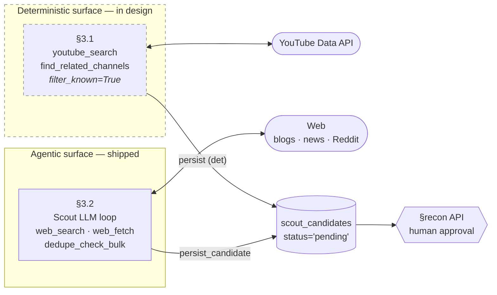
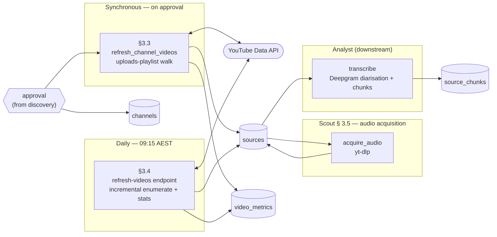

# Scout — Architecture

> Last reviewed: 2026-05-24.

How Scout works in depth: where it sits in the pipeline, what it writes (the hand-off contract), the discovery and tracked-source flows, the component internals, and the architecture under the expanded charter. For Scout's identity, scope, and voice see [README.md](README.md); for the locked design decisions see [charter.md](charter.md); for status and roadmap see [roadmap.md](roadmap.md).

---

## Pipeline position

Scout is the **inventory stage** of a multi-agent pipeline. It owns everything from "we don't know about this source" through "raw transcripts in the database." Parsing, scoring, numbers, and synthesis are downstream.

```
Scout       →  Analyst    →  Bookkeeper + Critic  →  Jaromelu
(this:         (extract)     (numbers + challenge)   (voice)
 inventory)
```

| Stage | Crew mode | System agent | What it does | Status |
|---|---|---|---|---|
| **Acquire** | **Scout** *(this doc)* | [source-discovery](../../system/source-discovery.md), [ingestion](../../system/ingestion.md), `scout/<pipeline>/*` folders (per D9) | Discover sources, enumerate content, refresh metadata, pull transcripts. **Also:** fetch SuperCoach roster + stats, NRL.com draw / match-centre / casualty-ward / ladder. | Media: shipped (YouTube). Data: Phases 1–4 shipped (SuperCoach roster + stats; nrl.com draw + match-centre + casualty-ward + ladder). The legacy `services/worker-scraper/` Temporal worker was retired 2026-05-28. |
| Extract | [Analyst](../analyst/README.md) | [extraction](../../system/extraction.md) (today via [Transcript Pipeline skill](../../skills/transcript-pipeline.md)) | Turn raw content into entities, quotes, claims; cross-reference for contradictions | Skill-based today; worker not built |
| Derive | [Bookkeeper](../bookkeeper/README.md) + [Critic](../critic/README.md) | [decision](../../system/decision.md) | Apply math to Scout-fetched numbers (breakevens, cap, alignment indices, consensus snapshots), rank, challenge thin evidence. Acquisition itself is now Scout's per the charter expansion. | Decision worker not built; derived metrics partial |
| Voice | [Jaromelu](../jaromelu/README.md) | [publishing](../../system/publishing.md) | Integrate everything, commit to a call, publish in the on-screen voice | Live |

---

## Hand-off contract

Scout's outputs are raw inventory rows only — Extract + Load, never Transform. The full chain Scout owns spans **media** (`scout_candidates → channels → sources → audio`) and **data** (`people / player_attributes / player_rounds / matches / match_team_lists / injuries / rounds`).

**Media writes:**

| Table | What Scout writes | What Scout does **not** write |
|---|---|---|
| `scout_candidates` | Full row at discovery (kind, title, score, content_categories, score_reasons, run_id, `status='pending'`) | — |
| `channels` | Full row at approval | — |
| `sources` | Full row at enumeration (`source_type`, title, canonical_url, `approved_flag=true`, `ingestion_status='pending'`) | — |
| `sources.audio_s3_key` + `ingestion_status='collected'` | Set on successful audio acquisition (§3.5) | `transcription_status`, `extraction_method` (Analyst) |
| `channel_metrics` / `video_metrics` | Full row per snapshot | — |

**Data writes (per the charter expansion):**

Every pipeline writes to **S3 (raw response)** + **DB (extracted projection)** per D10. The DB writes below reflect the post-extraction shape:

| Table | What Scout writes | Module folder | Phase |
|---|---|---|---|
| `people` | Roster upsert from SC `players-cf` | `scout/supercoach_roster/` | 1 ✅ |
| `player_attributes` | Position / team / contract (SCD-2); enriched by NRL.com profile data | `scout/supercoach_roster/` + `scout/nrlcom_players_roster/` | 1 ✅ / 4.5 |
| `people_roles` | Primary role tenure (SCD-2) | `scout/supercoach_roster/` | 1 ✅ |
| `claims` + `quotes` (from SC `notes[]`) | SC editorial commentary on players | `scout/supercoach_roster/` (extractor) | 2.5 |
| `teams.metadata_json.supercoach` | SC team IDs cross-reference | `scout/supercoach_teams/` | 2.5 |
| `sc_settings` (new) | SC game rules per season | `scout/supercoach_settings/` | 2.5 |
| `player_rounds` | Per-round stats — D11 merge of nrlcom match-centre + nrlsupercoachstats jqGrid | `scout/supercoach_stats/` + `scout/nrlcom_match_centre/` (extractor merges) | 2 ✅ / 3 |
| `matches` | Fixtures, results, score, venue, attendance, weather | `scout/nrlcom_draw/` + `scout/nrlcom_match_centre/` (extractor) | 3 |
| `match_team_lists` | Lineups from match-centre `positionGroups` + `players[]` | `scout/nrlcom_match_centre/` (extractor) | 3 |
| `player_match_stats` (new) | Per-player per-match 58-field stat line | `scout/nrlcom_match_centre/` (extractor) | 3 |
| `match_timeline` (new) | 100+ typed timeline events per match | `scout/nrlcom_match_centre/` (extractor) | 3 |
| `match_officials` (new) | Referee + touch judges + bunker per match | `scout/nrlcom_match_centre/` (extractor) | 3 |
| `rounds` | Round metadata derived from draw | `scout/nrlcom_draw/` (extractor) | 3 |
| `injuries` | Official casualty-ward state | `scout/nrlcom_casualty_ward/` | 4 |
| `team_standings` (new) | Ladder positions + 22 per-team metrics | `scout/nrlcom_ladder/` | 4 |
| `stat_leaderboards` (new) | Pre-computed top-25 leaderboards | `scout/nrlcom_stats/` | 4.5 |

Scout writes **nothing** to `source_documents`, `source_speakers`, `source_chunks` (Analyst's transcription writes), `source_chapters`, `source_annotations`, `quotes`, `claims`, `claim_chunks`, `claim_associations`, `consensus_snapshots`, `predictions`, `decisions`, `wiki_pages`, or any reasoning/output table. If a Scout-voiced UI line mentions parsed content (e.g. *"deep dive on Munster"*), that content was generated by a downstream agent and is being *surfaced through* Scout's voice mode — not produced by Scout itself.

---

## Flow

The full Scout function decomposes into two phases joined by a human-approval gate. The two phases answer two unrelated questions, so each gets its own diagram.

All current components are YouTube-only. Multi-platform expansion (podcasts, Twitter, blogs, Reddit) is roadmap — see [roadmap.md](roadmap.md). The diagrams below describe the YouTube path; each platform added later will instantiate the same shape (discovery surface → approval → enumerate → refresh → extract).

The architectural intent for the discovery phase is **deterministic-first for the bulk case, LLM for the long tail**:
- **Deterministic discovery** *(in design)* owns the cheap, fast, reproducible work: YouTube-native search and related-channel walks against a fixed seed-query bank, with server-side filtering against known IDs.
- **Agentic discovery** *(shipped)* owns what the LLM is uniquely good at: off-platform reach (blog / news / Reddit mentions YouTube doesn't see), semantic quality filtering, and coverage-gap targeting.

Both surfaces file into the same `scout_candidates` table. Human approval is the seam where LLM judgement stops and idempotent pipelines take over.

### Discovery — *how do candidates land in `scout_candidates`?*



**Legend:** rounded ovals = external systems · cylinders = DB tables · hexagon = human gate · dashed = in design.

**Trace:**
1. **Daily deterministic sweep** (§3.1, in design) — cron runs `youtube_search` over the seed-query bank and `find_related_channels` over every tracked channel. `filter_known=True` means the API call returns only novel IDs. Results persist with `discovered_via='youtube_search' | 'related_channels'`.
2. **Weekly agentic sweep** (§3.2) — Scout LLM loop runs on a slower cadence with a brief that says *"deterministic covers YouTube-native; your job is off-platform reach and the long tail."* Uses `web_search` for blog/news/Reddit mentions, `web_fetch` to read About pages and judge quality, persists what survives.
3. **Human reviews** — admin lists pending candidates via the recon API (regardless of source) and approves or rejects.

**Today vs target:**

| Aspect | Today (shipped) | Target (after deterministic surface lands) |
|---|---|---|
| Bulk YouTube discovery | LLM with `web_search` (slow, expensive) | YouTube API (sub-second, ~$0) |
| Adjacency expansion | LLM intuition | `find_related_channels` (deterministic) |
| Off-platform mentions | LLM with `web_search` | LLM with `web_search` (unchanged) |
| Semantic quality filter | LLM (during search) | LLM (focused, on a smaller candidate set) |
| Cost / run | ~$0.40–$1.00 per agentic run | ~$0 deterministic + ~$0.20 weekly LLM |
| Cadence | Manual CLI | Daily deterministic + weekly LLM |

### Tracked-source operations — *how do we keep approved sources current and extract their content?*



**Legend:** rounded ovals = external systems · cylinders = DB tables · hexagon = upstream gate · subgraphs = cadence (sync / daily / dev-only).

**Trace:**
1. **Sync enumeration** (§3.3) — recon-approval handler commits `channels`, then synchronously calls `refresh_channel_videos(full_backfill=True)`. The channel's uploads playlist is walked (capped 200), each video inserted as a `sources` row, and a discovery-time `video_metrics` snapshot is written per video.
2. **Daily cron keeps things current** (§3.4) — `POST /admin/scout/refresh-videos` walks each channel for new uploads using the last known `video_id` as cursor (typically 1 quota unit / channel / day) and re-snapshots stats for every YouTube source. ~750 quota units / pass.
3. **Audio gets collected** (§3.5) — `acquire_audio()` pulls m4a via yt-dlp and lands it in `s3://jeromelu-raw-audio/...`, setting `audio_s3_key` and `ingestion_status='collected'`. Transcription is the next step (Analyst, [transcription](../../system/transcription-pipeline.md)). Recurring drain job over `ingestion_status='pending'` sources is on the backlog.

---

## Components

Each component follows the same internal structure — trigger, inputs, processing, outputs, audit — so the five are directly comparable. Components are listed **deterministic-first** to reflect architectural intent (the deterministic surface owns the bulk; the agentic surface is the long-tail layer once both ship), not current build status.

### 3.1 Deterministic discovery `[deterministic, in design]`

Cheap, fast, reproducible YouTube-native discovery. Owns the bulk case (new uploads, adjacent channels) so the agentic surface is freed for off-platform and semantic work. Not yet built — design intent recorded here.

**Trigger** — Daily cron (proposed: 06:00 AET to land before morning content windows).

**Inputs**
- Seed query bank (versioned config) — broad NRL terms ("NRL podcast", "supercoach analysis", "NRLW review", "Cowboys breakdown", etc.)
- Every active channel in `channels` (for related-channel walks)
- YouTube Data API key
- Read-side: `channels.external_id`, `sources.canonical_url`, `scout_candidates.(platform,kind,external_id)` for the server-side filter

**Processing**
1. **`youtube_search(query, filter_known=True)`** — for each seed query, calls `search.list?type=channel,video&regionCode=AU`. Implementation filters returned IDs against the known-set in-process *before* returning to the caller. The agent / persist layer never sees a known result.
2. **`find_related_channels(known_channel_id, limit=10)`** — for each tracked channel, pulls related channels via YouTube's "channels related to" signal (or scrapes the channel's featured-channels surface as fallback). Filters known.
3. Persists novel results directly to `scout_candidates` with `status='pending'` and `discovered_via='youtube_search' | 'related_channels'`. Idempotent on `(platform, kind, external_id)`.

**Outputs** — rows in `scout_candidates` (same table as §3.2, distinguished by `discovered_via`). No score / content_categories on first pass — those are added post-hoc by a lightweight scoring pass (could be deterministic heuristics or a small LLM batch).

**Quota budget** — `search.list` = 100 units/call. ~10 seed queries × daily = 7,000 units/week. ~150 channels × `channels.list?relatedToChannelId` = depends on endpoint cost (verify during implementation). Target: stay within 10,000-unit/day free tier including the daily refresh job (§3.4, ~750 units/day).

**Audit** — needs to land on `agent_runs` even though there's no LLM (treat the cron run as an "agent" of `agent_id='scout-det'` for unified cost/health dashboards). Open question — see [roadmap.md](roadmap.md).

### 3.2 Discovery agent `[agentic]`

The web-hunting LLM loop. Files candidate channels and videos to `scout_candidates`. Today this is the *only* discovery surface; once the deterministic surface (§3.1) ships, it becomes the long-tail / off-platform surface.

**Trigger** — Manual CLI: `python -m app.scout.source_discovery.cli` (flags: `--dry-run`, `--max-turns`, `--budget`, `--brief`). Scheduled runs are planned.

**Inputs**
- System prompt (cacheable, ~1.1k tokens) — Scout voice + scope + tagging taxonomy
- Per-run user brief carrying the **anti-rediscovery known-set** (every tracked channel + every previously-surfaced candidate, with "search adjacent" instruction)
- Bounds: 20 turns, 60 tool calls, 900s wall-clock, $1 budget
- Tools:

| Tool | Type | Use |
|---|---|---|
| `web_search` | Anthropic built-in (`web_search_20250305`) | NRL queries, AU geo bias |
| `web_fetch` | Anthropic built-in (`web_fetch_20250209`) | Drill into a channel/video page |
| `dedupe_check_bulk` | Custom | Batched front-door firewall against `channels` / `sources` / `scout_candidates` |
| `dedupe_check` | Custom | Single-item variant for one-off investigations |
| `persist_candidate` | Custom | Idempotent INSERT into `scout_candidates` (`status='pending'`) |

**Processing** — multi-turn streaming loop in `services/api/app/scout/source_discovery/agent.py`. Each turn: assistant emits text + tool calls; client-side handlers run dedupe / persist; server-side tools execute on Anthropic's side. Loop ends on `end_turn` or first bound hit.

**Outputs** — rows in `scout_candidates` (kind, title, score, content_categories, score_reasons, run_id, `status='pending'`, `discovered_via='web_search'`). Console theatre: per-turn text streamed live, one line per tool call.

**Audit** — full standard pattern (see [`agent-audit.md`](../../system/agent-audit.md)):
- `agent_runs` — `started` and `completed`/`failed` rows joined on `run_id`. Cost, tokens, candidates filed, dupes skipped, S3 log key
- `agent_events` — forensic per-event trace (turn_started, text, tool_use, tool_result, server_block, turn_complete, bound_hit, error, run_ended). Live-readable mid-run
- S3 JSONL bundle — `agent-logs/scout/{YYYY}/{MM}/{DD}/{run_id}.jsonl` on `jeromelu-clean-documents`

### 3.3 Post-approval enumerator `[deterministic]`

Runs synchronously inside the recon-approval HTTP handler. Pulls a freshly-approved channel's full uploads playlist and snapshots metrics.

**Trigger** — admin approve action on a `scout_candidates` candidate of `kind='channel'`, via `app/routers/recon.py`.

**Inputs** — approved `channels` row, YouTube Data API key, `full_backfill=True`.

**Processing** — `refresh_channel_videos()`:
1. Walks the channel's uploads playlist (`UU` + last 22 chars of `UC...` channel id) via `playlistItems.list`. Newest first, capped 200. ~1 quota unit per page of 50.
2. Inserts each video as a `sources` row (`source_type='youtube'`, `approved_flag=true`, `ingestion_status='pending'`). Idempotent on `canonical_url`.
3. Calls `videos.list?part=statistics,contentDetails` (1 unit per 50 ids) and writes one `video_metrics` row per newly-inserted video as the discovery-time snapshot.

**Outputs** — `sources` rows (videos), `video_metrics` snapshot rows.

**Failure mode** — approval still commits if YouTube API fails; channel is in `channels`, admin can re-trigger via the per-channel endpoint (§3.4 — `POST /admin/scout/channels/{ref}/refresh-videos?full_backfill=true`) without waiting for the daily cron.

**Audit** — currently logged through the recon endpoint's standard request log (no `agent_runs` row — this is a deterministic post-processing step, not an agent run).

### 3.4 Daily refresh job `[deterministic]`

Keeps every tracked YouTube channel's video list and per-video popularity numbers current. Idempotent.

**Trigger** — `POST /api/admin/scout/refresh-videos` with `X-Admin-Key`. Optional `?skip_stats=true` or `?skip_enumerate=true`. Cron suggestion: Mon 09:00 AET.

**Inputs** — every active YouTube channel and source in the DB; YouTube Data API key.

**Processing** — two phases:
1. **Incremental enumerate** (`refresh_all_channels_incremental`) — for each active channel, find the most recent already-known `sources.canonical_url`, extract its `video_id`, pass as the `after_video_id` cursor to `playlistItems.list`. Walker stops on cursor — typical week is one page (1 quota unit) and zero new videos per channel.
2. **Stats refresh** (`refresh_all_video_stats`) — pulls every YouTube source, batches `videos.list` 50 ids at a time, appends one `video_metrics` row per video. ~1 quota unit per 50 videos.

**Outputs** — new `sources` rows for fresh uploads + new `video_metrics` rows. Total ~750 YouTube quota units per pass against a 10,000-unit free tier.

**Per-channel ad-hoc variant** — `POST /api/admin/scout/channels/{ref}/refresh-videos[?full_backfill=true][&max_results=N]` runs `refresh_channel_videos()` for a single channel on demand. Path param accepts UUID or slug. Use to recover a channel whose approval-time enumerate (§3.3) failed (`full_backfill=true`), or to force-pull one channel's new uploads between daily runs (incremental). `max_results` defaults to 200 and is hard-capped at 15000 by the YouTube helper — sized for broadcaster archives (NRL / WWOS / NRL on Nine each have ~11-12k uploads). Make wrapper: `make prod-refresh-channel-videos CHANNEL=<uuid-or-slug> [FULL_BACKFILL=1] [MAX_RESULTS=15000] ADMIN_KEY=xxx`.

**Downstream** — once `video_metrics` has 2+ samples per video, view-velocity ranking becomes available (SQL in [the spec](../../system/source-discovery.md#influence-ranking)).

**Gap** — channel-level metadata (`channel_metrics`: subs, total views, video count, name changes, active/inactive) is only written at *approval time* today. It does not get periodically refreshed. Weekly channel-stats refresh is on the roadmap.

**Audit** — endpoint return value reports counts; no `agent_runs` row.

### 3.5 Audio acquisition `[deterministic, shipped]`

Scout's last Extract step. Pulls audio from approved-but-pending YouTube sources and lands it in S3. **Extract only** — does not interpret the audio. Transcription / diarisation belongs to [Analyst](../analyst/README.md) (see [analyst/transcription](../../system/transcription-pipeline.md)).

**Trigger** — Manual CLI: `python -m app.scout.media.cli.audio <source_id>` or `make collect-audio SOURCE_ID=<uuid>`. The recurring drain job (APScheduler / cron over `ingestion_status='pending'`) is on the backlog.

**Module** — `services/api/app/scout/media/audio.py` · `acquire_audio(session, source)`.

**Processing** — for one approved-but-pending video:
1. `yt-dlp` audio download (m4a, audio-only) → `s3://jeromelu-raw-audio/youtube/{channel_id}/{video_id}.m4a`. Idempotent: skipped if the S3 object already exists.
2. `sources.audio_s3_key` set; `sources.ingestion_status='collected'`.

**Status** — Shipped 2026-05-03 (split out from the combined extract module on 2026-05-02). The legacy Temporal-shaped `IntelSweepWorkflow` (`services/worker-ingestion/`) is superseded; files remain in tree but nothing invokes them.

**Outputs** — m4a in S3, `audio_s3_key` populated, `ingestion_status='collected'`. **No** `source_documents`, `source_speakers`, or `source_chunks` rows — those are Analyst's writes.

**Failure mode** — no fallback chain. On `yt-dlp` failure: `sources.ingestion_status='failed'`, `AudioError` raised. Operator inspects and re-runs.

**Hand-off boundary** — Scout is done when the source row has `ingestion_status='collected'` and `audio_s3_key` set. Analyst picks it up from there:
- Transcription + diarisation + chunking ([analyst/transcription](../../system/transcription-pipeline.md))
- Cleaning pass (`source_documents.cleaned_text`, `source_chunks.clean_text`)
- Embedding pass (`source_chunks.embedding`)
- Speaker → Person resolution (`source_speakers.speaker_person_id`)
- Claim / quote extraction

---

## Architecture under the expanded charter

The expanded charter (see [charter.md](charter.md)) generalises this media-side shape to all external data acquisition. One Scout identity, many modules; raw JSON captured to S3 first, then projected into DB tables by downstream extractors.

```
External world
       │
       ▼
┌─────────────────────────────────────────────────────────┐
│ Scout (one agent identity, many modules)                │
│                                                         │
│  Media (scout/media/ + youtube/, source_discovery/):    │
│    • discovery (loop.py + refresh.py)                   │
│    • audio acquisition (audio.py)                       │
│    • metadata refresh                                   │
│                                                         │
│  Data — supercoach.com.au (folder per pipeline, D9):    │
│    • scout/supercoach_roster/                  shipped  │
│    • scout/supercoach_teams/                   new      │
│    • scout/supercoach_settings/                new      │
│    • scout/supercoach_draft_*/                 optional │
│                                                         │
│  Data — nrl.com (canonical per D11):                    │
│    • scout/nrlcom_draw/                        new      │
│    • scout/nrlcom_match_centre/                new ★    │
│    • scout/nrlcom_casualty_ward/               new      │
│    • scout/nrlcom_ladder/                      new      │
│    • scout/nrlcom_stats/                       new      │
│    • scout/nrlcom_players_roster/              partial  │
│                                                         │
│  Data — nrlsupercoachstats.com:                         │
│    • scout/supercoach_stats/                   shipped  │
└─────────────────────────────────────────────────────────┘
       │
       ▼ (S3-first per D10)
┌─────────────────────────────────────────────────────────┐
│ s3://jeromelu-clean-documents/scout/{source}/{pipeline} │
│        — raw JSON snapshots, durable, replayable        │
└─────────────────────────────────────────────────────────┘
       │
       ▼ (extractors per D13)
┌─────────────────────────────────────────────────────────┐
│ DB tables — projection of S3 with trust-hierarchy (D11) │
│   people, matches, match_team_lists, player_rounds,     │
│   injuries, team_standings, claims/quotes from notes,…  │
└─────────────────────────────────────────────────────────┘
       │
       ▼
┌──────────────────────────────────────────────┐
│ Analyst — cleaning, diarisation, extraction  │
│ Bookkeeper — math, derivations               │
│ Archivist — wiki prose composition           │
│ Jaromelu — voicing                           │
└──────────────────────────────────────────────┘
```

**Shared shape across all Scout modules:**

1. Each module exposes a single function (e.g. `refresh_supercoach_roster(session) -> RunResult`) that fetches, upserts idempotently, returns counts.
2. Each module gets an admin endpoint (`POST /api/admin/scout/<pipeline>`) that wraps the function in the `agent_runs` audit pattern (`record_agent_started/ended`).
3. Each module's wrapper writes one `agent_runs` row with `agent_id='scout'`, `detail_json.pipeline='<module>'`, plus per-run counts (rows fetched, rows upserted, rows skipped, errors).
4. Each module is independently cron-triggerable via the endpoint.
5. Each module emits unknown-field warnings to `agent_events` when the upstream source returns shapes the parser doesn't recognise — early-warning for source drift.

This is the pattern Scout's media side already follows; the expansion just instantiates it for more modules.

---

## Related

- [README.md](README.md) — Scout's identity, scope, and voice
- [charter.md](charter.md) — locked design decisions D1–D13
- [roadmap.md](roadmap.md) — status and forward plan
- [Data lineage](../../../architecture/data-lineage.md) — end-to-end source → S3 → DB → app map for every Scout pipeline output
- [Source discovery system spec](../../system/source-discovery.md) — full architecture, schema, SQL recipes, CLI flags, audit-trail recipes
- [Ingestion system spec](../../system/ingestion.md) — `IntelSweepWorkflow` and transcript pull
- [Agent audit pattern](../../system/agent-audit.md) — `agent_runs` / `agent_events` / S3 conventions shared across all SDK agents
